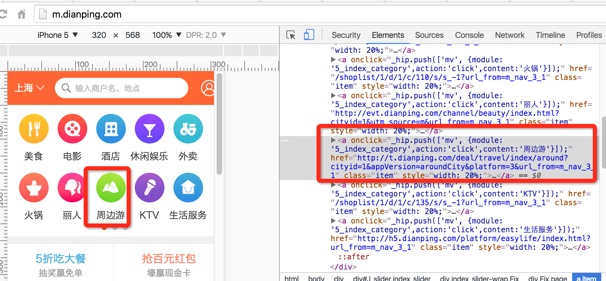

# front-end-growing
前端进阶指南
[前端开发面试题](https://github.com/jiehwa/My-blog/tree/master/Front-end-Developer-Questions/Questions-and-Answers)  
这里的只是一个提纲，很多细节的东西会提供很多链接，需要自己去看去思考。前端尽量不要去买书，更新太快了。一般看文档就行，或者网上搜索。
## 初级
### 1.掌握基础的HTML语法，能分清各个标签的作用和使用场景
学习方法：这部分在日常开发中会自然积累，无需死记硬背。熟悉这些标签是渐进的一个过程，熟悉了之后再写代码时候就会快点。初学如果不熟都可以查文档，记住，文档是最好的老师。推荐 [w3cshcool](http://www.w3school.com.cn/)或者[火狐浏览器web开发者文档](https://developer.mozilla.org/zh-CN/).或者使用Google（是在不行可以用百度）搜索“HTML {这里的关键词为你要查的html元素}”
要求：
1.知道哪些是块级标签，哪些是行内标签。知道通过`display`属性来更改标签的作用，能分清楚`inline`，`inline-block`,`block`区别.
2.知道哪些是html5标签，分别用来干嘛。可以参照[MDN上面的总结](https://developer.mozilla.org/zh-CN/docs/Web/Guide/HTML/HTML5/HTML5_element_list)
#### 1.1 a标签（伪类标签）
* a标签最常用的作用是作为一个文本超链接，因为本身是行内标签。

```
<a href="#" ></a>
```
如果a标签不需要里面的链接起作用，只是作为一个类似button功能的可点击元素，
一般这么写：

```
<a href="javascript:;" ></a>
```

* a标签同时用于一整块的可点击区域，但是此时要将`display`属性改为`inline-block`或者`block`再将内容嵌入。因为只有块级元素才可以里面嵌套元素，改变宽和高的样式。


类似的用法可以自己去研究，注：a标签一个onclick属性里面的代码是用来打点的，可以忽略。`需要特别注意：`a标签里面不能嵌套a标签，否则浏览器会自动将两个a标签隔断。
例子：

```
//错误代码
<a class="a111">
   a1111
	<a class="a222">
	</a>
	a22222
</a>
 //浏览器会解析成这样，从而导致你的html结构都变了
<a class="a111">
   a1111
 </a>
<a class="a222">
	a22222
</a>
```

* `a:hover`的使用：表示当鼠标放上去之后的元素样式，通过控制自身或者包在里面的子元素的css样式的`display`属性，隐藏或者出现某个元素，实现折叠菜单效果：
* 更多关于[伪类选择器](http://www.w3cplus.com/css3/pseudo-class-selector)可以参考这个

#### 1.2 表单类标签
html表单类标签（form标签）是用来给用户交互的，比如：输入框input,下拉框select,单选框readio,多选框。html表单可以放在form标签里面，也可以不放在里面。一般建议不要放在form里面，form标签。

* 1.form标签：`action`属性是后台服务器的一个路径,表示你要提交的数据传到这个地址，后台服务器会对你表单里的数据进行处理。`method`：表示提交方法，表单最好用post方式，就会将所有的数据藏起来放在http里面，如果用`get`方式提交，数据会以`http://www.dianping.com/handler?p1=xxx&p2=yyy`,其中p1和p2是input标签里的name属性，xxx和yyy就是里面的value属性，表示这个输入框的值。

```
<form action="http://www.dianping.com/handler" method="post">
 //所有表单元素可以放在这里
 <input type="text" name="p1" class="" value=""/>
 <input type="text" name="p2" class="" value=""/>
</form>
```
* 2.input标签：使用最多，单行文本输入框，最常见的地方就是登录框。

``` 
 <input type="text" name="p1" class="" value=""/>
 //1.type表示文本框可以输入的内容，text表示是文本。还可以是number,表示这个只能输入数字，在手机里面打开这个网页的话就会默认调出数字输入法框
 //2.name表示这个输入框的的识别名称，同一个页面不可以有一模一样的name,为了方便js去统一管理数据提交，设置class属性方便选择该元素。
```
* 3.textarea 文本域 ，input只能输入一行，输入再多东西，都只有一直向后。为了用户提交一大段的东西，这时候就必须用到这个标签了。

```
<textarea rows="10" cols="30"/>
//也可以闭合
如：
<textarea rows="10" cols="30"></textarea>
//rows表示几行，cols表示几列
```
* 单选框([点击这里看例子](http://www.w3school.com.cn/tiy/t.asp?f=html_radiobuttons))

```
<form>
男性：
<input type="radio" checked="checked" name="Sex" value="male" />
<br />
女性：
<input type="radio" name="Sex" value="female" />
</form>
```
<form>
男性：
<input type="radio" checked="checked" name="Sex" value="male" />
<br />
女性：
<input type="radio" name="Sex" value="female" />
</form>

* 复选框([点击这里看例子](http://www.w3school.com.cn/tiy/t.asp?f=html_checkboxes))

```
<form>
我喜欢自行车：
<input type="checkbox" name="Bike">
<br />
我喜欢汽车：
<input type="checkbox" name="Car">
</form>

```

<form>
我喜欢自行车：
<input type="checkbox" name="Bike">
<br />
我喜欢汽车：
<input type="checkbox" name="Car">
</form>


* 下拉框

```
<form>
<select name="cars">
	<option value="volvo">Volvo</option>
	<option value="saab">Saab</option>
	<option value="fiat">Fiat</option>
	<option value="audi">Audi</option>
</select>
</form>
//option是里面的每一个可以选择的下拉选项
```
<form>
<select name="cars">
<option value="volvo">Volvo</option>
<option value="saab">Saab</option>
<option value="fiat">Fiat</option>
<option value="audi">Audi</option>
</select>
</form>

### 2.理解css盒子模型，学会常见布局
#### 2.1能描述出来盒子模型
#### 2.2利用`box-sizing`来改变浏览器的计算盒子模型的规则
#### 2.3能够利用盒子模型构造出常见网页布局

[css参考手册](http://css.doyoe.com/)

### 3.理解float浮动和position定位
#### 3.1 float
* 什么是浮动，左浮动和右浮动，怎么清除浮动，

#### 3.1 position
* `position`有哪些：absolute(绝对定位)，relative（相对定位），fixed(固定位置)
* 能说出上面三个定位的区别

### 4.熟悉了解css3的小技巧
* 4.1 一行文字超过某个长度使用省略号，两行文字省略号怎么处理
 [大众点评M站](http://m.dianping.com/)下面的商户列表项中的标题使用了一行超过显示省略号，详情介绍使用了`两行`超过显示省略号
* 4.2 圆形头像，设置边框圆角`border-radius`
* 4.3 利用css3`transfrom`属性对元素进行放大，旋转
例子：[大众点评M站](http://m.dianping.com/)头部城市名字右侧的倒下来的类似下拉按钮怎么实现

### 5.JavaScript基础知识
### 6.了解最基础的DOM编程
### 7.熟悉jQuery的API
